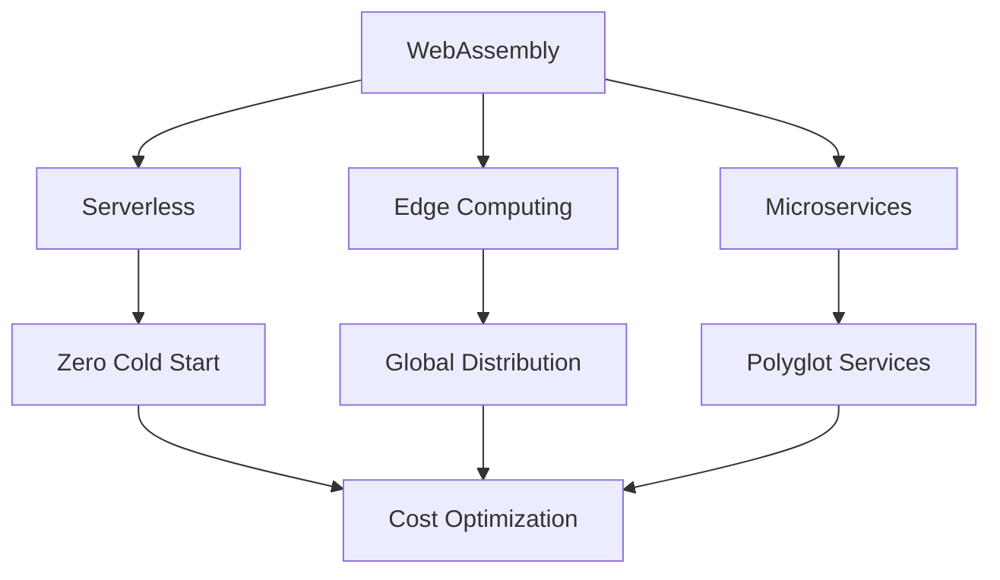

# 📈 WebAssembly Container Revolution: 200% Growth Analysis

## 📋 Метаинформация

| Параметр | Значение |
|----------|----------|
| **Дата исследования** | 2025-01-20 |
| **Источник** | CNCF Annual Survey 2025 |
| **Тип материала** | Trend Analysis |
| **Важность** | 4/5 ⭐⭐⭐⭐ |
| **Категория** | trend |
| **Теги** | `webassembly`, `serverless`, `performance`, `trend` |

## 📖 Исполнительное резюме

WebAssembly (WASM) переживает беспрецедентный рост в production environments с 200% увеличением adoption rate за 2024 год. Исследование CNCF показывает фундаментальный сдвиг в архитектуре serverless и edge computing приложений.

## 📊 Ключевые данные исследования

### Статистика роста
- **Production adoption**: +200% за 2024 год
- **Developer interest**: 65% планируют внедрение к 2027
- **Enterprise usage**: +150% в Fortune 500
- **Edge deployments**: +300% в IoT и mobile

### Performance метрики
| Метрика | Traditional Containers | WASM Containers | Улучшение |
|---------|----------------------|-----------------|-----------|
| **Cold start** | 2-5 секунд | 10-50ms | **50-500x** |
| **Memory usage** | 50-200MB | 1-10MB | **5-20x** |
| **Binary size** | 100-500MB | 1-20MB | **5-50x** |
| **Startup CPU** | 100-500m | 10-50m | **2-10x** |

## 🚀 Технологические драйверы

### Runtime экосистема

#### WasmEdge (лидер enterprise)
```bash
# Production deployment example
docker run --runtime=io.containerd.wasmedge.v1 \
  --platform=wasi/wasm \
  myapp:wasm
```

**Преимущества**:
- Kubernetes native integration
- GPU acceleration support  
- Enterprise security features
- Multi-language support

#### Wasmtime (Mozilla)
```rust
// Rust WebAssembly example
use wasmtime::*;

fn main() -> Result<()> {
    let engine = Engine::default();
    let module = Module::from_file(&engine, "hello.wasm")?;
    let mut store = Store::new(&engine, ());
    let instance = Instance::new(&mut store, &module, &[])?;
    
    let hello = instance.get_typed_func::<(), ()>(&mut store, "hello")?;
    hello.call(&mut store, ())?;
    Ok(())
}
```

#### Wasmer (Universal runtime)
- Cross-platform execution
- Native performance
- Language agnostic

### Kubernetes integration

#### Containerd WASM support
```yaml
apiVersion: v1
kind: Pod
metadata:
  name: wasm-app
spec:
  runtimeClassName: wasmedge
  containers:
  - name: app
    image: myregistry/wasm-app:latest
    resources:
      limits:
        memory: "64Mi"
        cpu: "50m"
```

#### SpinKube operator
```yaml
apiVersion: spin.dev/v1alpha1
kind: SpinApp
metadata:
  name: hello-world
spec:
  image: ghcr.io/fermyon/hello-world:latest
  replicas: 3
  executor: containerd-shim-spin
```

## 🏭 Production Use Cases

### Serverless Functions

#### AWS Lambda alternative
```yaml
# Fermyon Cloud deployment
name = "lambda-killer"
version = "1.0.0"
authors = ["DevOps Team <team@company.com>"]

[[trigger.http]]
route = "/api/..."
component = "main"

[component.main]
source = "target/wasm32-wasi/release/app.wasm"
allowed_http_hosts = ["api.external.com"]
```

**Результаты**:
- **Cold start**: 5ms vs 2sec Lambda
- **Cost**: -70% за счет лучшего utilization
- **Scalability**: 0 to 10k instances за секунды

### Edge Computing

#### CDN edge functions
```javascript
// Fastly Compute@Edge example  
addEventListener("fetch", event => {
  event.respondWith(handleRequest(event.request))
})

async function handleRequest(request) {
  // WASM модуль выполняется на edge
  const response = await wasmModule.process(request)
  return new Response(response, {
    headers: { "Cache-Control": "max-age=86400" }
  })
}
```

**Преимущества**:
- Выполнение ближе к пользователям
- Консистентная performance по всему миру
- Безопасная изоляция

### Microservices Architecture

#### Service mesh integration
```yaml
apiVersion: networking.istio.io/v1alpha3
kind: EnvoyFilter
metadata:
  name: wasm-filter
spec:
  configPatches:
  - applyTo: HTTP_FILTER
    match:
      context: SIDECAR_INBOUND
    patch:
      operation: INSERT_BEFORE
      value:
        name: envoy.filters.http.wasm
        typed_config:
          "@type": type.googleapis.com/envoy.extensions.filters.http.wasm.v3.Wasm
          config:
            root_id: my_root_id
            vm_config:
              runtime: envoy.wasm.runtime.v8
              code:
                local:
                  inline_string: |
                    // WASM код для обработки трафика
```

## 📈 Индустриальные тренды

### Developer Experience

#### Toolchain зрелость
```bash
# Modern WASM development workflow
cargo install cargo-wasi
cargo wasi new hello-world
cargo wasi build --release

# Container packaging
docker build -t myapp:wasm .
docker push myregistry/myapp:wasm
```

#### Language support expansion
- **Rust**: First-class support, zero-copy optimization
- **Go**: TinyGo для WASM, improving performance
- **JavaScript**: V8 integration, Node.js compatibility  
- **Python**: PyOdide, scientific computing
- **C++**: Emscripten, legacy code migration

### Enterprise Adoption Patterns

#### Financial Services
```yaml
# Real-time trading algorithm
apiVersion: apps/v1
kind: Deployment
metadata:
  name: trading-engine
spec:
  replicas: 100
  template:
    spec:
      runtimeClassName: wasmedge
      containers:
      - name: algorithm
        image: trading/algo:wasm
        resources:
          limits:
            memory: "32Mi"  # Minimal footprint
            cpu: "100m"
        env:
        - name: LATENCY_TARGET
          value: "1ms"
```

**Результаты**:
- **Latency**: <1ms обработка сделок
- **Density**: 10x больше алгоритмов на ноду
- **Security**: Полная изоляция между алгоритмами

#### IoT и Edge Manufacturing
- **Predictive maintenance**: WASM модули на edge devices
- **Quality control**: Real-time image processing
- **Supply chain**: Distributed computation

## 🔮 Прогнозы развития

### 2025 прогнозы

#### Q2 2025: Kubernetes native
- **Kubernetes 1.30**: Native WASM container support
- **Helm charts**: WASM-specific deployment patterns
- **Operators**: Specialized WASM workload management

#### Q3-Q4 2025: Ecosystem maturity
- **Service mesh**: Istio/Linkerd WASM plugin ecosystem
- **Observability**: Prometheus/Grafana WASM metrics
- **CI/CD**: GitHub Actions, GitLab CI WASM runners

### 2026-2027: Mass adoption

#### Technology convergence


#### Market predictions
- **65% serverless workloads** на WASM к 2027
- **$2B market size** для WASM tooling
- **Major cloud providers** native WASM services

## ⚠️ Challenges и Limitations

### Текущие ограничения

#### Performance gaps
```yaml
# Scenarios где traditional containers лучше
workloads:
  compute_intensive:
    - Deep learning training
    - Video encoding  
    - Scientific computing
  io_intensive:
    - Database engines
    - File processing
    - Network intensive apps
```

#### Ecosystem maturity
- **Limited stdlib**: Не все системные API доступны
- **Debugging tools**: Менее зрелые чем traditional
- **Library ecosystem**: Растет, но еще неполный

### Security considerations
- **Sandbox escape**: Теоретически возможны
- **Side-channel attacks**: В shared environments
- **Supply chain**: Новые векторы атак через WASM modules

## 🛠️ Практические рекомендации

### When to choose WASM

#### Идеальные сценарии
- ✅ **Serverless functions** с частыми cold starts
- ✅ **Edge computing** с ограниченными ресурсами
- ✅ **Microservices** с высокими требованиями к density
- ✅ **Plugin systems** с строгой изоляцией

#### Когда остаться с традиционными контейнерами
- ❌ **Legacy applications** без возможности портирования
- ❌ **Database workloads** с интенсивным I/O
- ❌ **GPU-heavy** machine learning training
- ❌ **Complex networking** требования

### Migration strategy

#### Phase 1: Experimentation (Q1 2025)
```bash
# Start with simple functions
cargo wasi new hello-api
cd hello-api
cargo wasi build --release

# Deploy to development
kubectl apply -f wasm-pod.yaml
```

#### Phase 2: Pilot production (Q2 2025)
- Select 1-2 microservices
- Measure performance impact
- Compare costs and resource usage

#### Phase 3: Scale adoption (Q3-Q4 2025)
- Migrate suitable workloads
- Build WASM expertise in team
- Establish best practices

## 📚 Связанные материалы

### Container Technologies
- [Next Generation](../../container-docker-podman/next-generation/README.md)
- [Traditional vs Modern](../../container-docker-podman/traditional/README.md)
- [Edge Native](../../container-docker-podman/edge-native/README.md)

### Learning Resources
- [WebAssembly Official](https://webassembly.org/)
- [WASI Specification](https://wasi.dev/)
- [Fermyon Platform](https://fermyon.com/)
- [WasmEdge Runtime](https://wasmedge.org/)

### Tools и Frameworks
```bash
# Essential WASM tools
cargo install wasm-pack        # Rust to WASM
npm install -g @wasmer/cli     # Universal runtime
brew install wasmtime          # Mozilla runtime
docker pull wasmedge/slim      # Container runtime
```

## 🏷️ Теги для поиска

#webassembly #wasm #serverless #edge-computing #performance #trend #kubernetes #containers #cloud-native #future-tech

---

> 📅 **Опубликовано**: 2025-01-20  
> 📊 **Источник**: CNCF Annual Survey 2025  
> 🔄 **Следующее обновление**: Q2 2025  
> 📢 **Анонс**: [@DevOps_best_practices](https://t.me/DevOps_best_practices)

*WebAssembly революция только начинается. Готовьтесь к фундаментальным изменениям в cloud native landscape.*